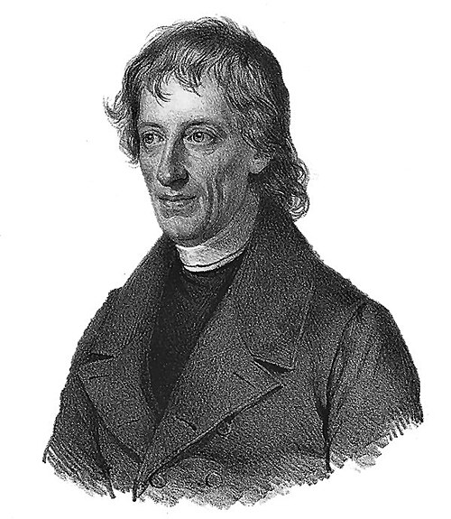
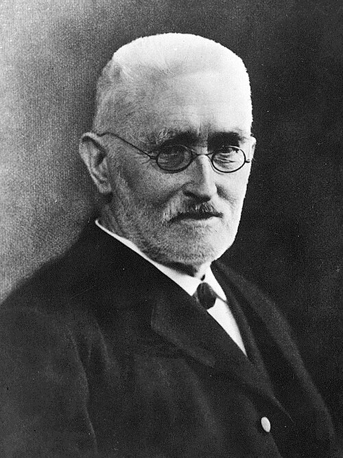
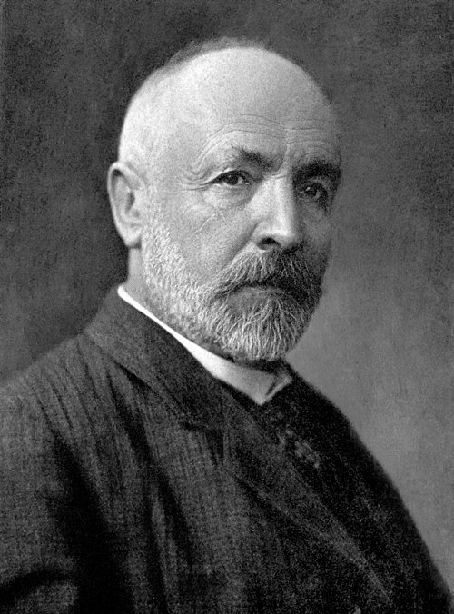
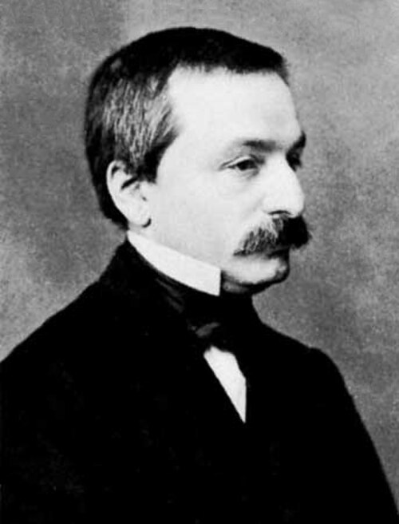
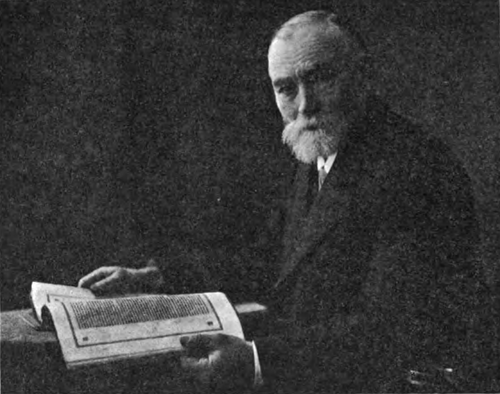
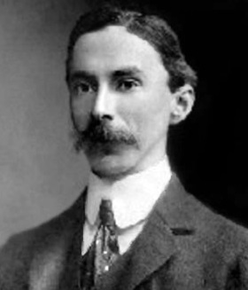

## Where We're Going {.smaller}

- This course compares three modern foundations of mathematics: **set theory**, **category theory**, **type theory**
- Before any of that: a 19th-century story about **rigor**, **completeness**, and **infinity**
- Today: Prologue -- Bolzano (1817) $\to$ Dedekind (1872) $\to$ Cantor (1874)

## Gauss and the Fundamental Theorem of Algebra

- **THM:** Every non-constant polynomial has a root over the complex numbers.
- Gauss's proofs (from 1799 on) quietly depend on the **Intermediate Value Theorem**

$$
f \text{ continuous},\ f(a)<0,\ f(b)>0 \ \implies\ f(c)=0 \text{ for some } c\in(a,b)
$$

- IVT feels obvious: a curve can't get from below the axis to above it without crossing. (Gauss and many others at the time thought so.)
<!-- - But *why* is it true? -->

## Bolzano's Insight (1817)

:::: {.columns}

::: {.column width="65%"}
Bernard Bolzano was the first to realize importance of **continuity** in the proof of Fundamental Theorem of Algebra.

- He attempted a genuine proof of the IVT.
- But he had **no clear concept of the real numbers** to work with.
- His proof was not fully satisfactory — a rigorous treatment of continuity had to wait for **Weierstrass (1874)**.
:::

::: {.column width="35%"}
{.portrait fig-align="center" width="85%"}

::: {.caption}
Bernard Bolzano\
(1781–1848)
:::
:::

::::

## Completeness: An Ancient Intuition

Bolzano's realization:

$$
\text{completeness of } \mathbb{R} \quad\longleftrightarrow\quad \text{absence of gaps}
$$

- Ancient intuition: a line has no gaps
- But then — **what are the "parts" of a line?**

To capture this, Bolzano introduced two principles:

- the **least upper bound principle**
- the **nested interval property**

## How to Prove Completeness?

- Bolzano could *state* completeness — but not *prove* it
- Proving it requires first knowing what a real number **is**
- That formalization of $\mathbb{R}$ did not arrive until the **1870s**
  - e.g. via **Dedekind cuts**

## Dedekind's Breakthrough (1872)

:::: {.columns}

::: {.column width="65%"}
Dedekind's key move: stop presupposing what $x \in \mathbb{R}$ is.

> A real number **is** a Dedekind cut $(L, U)$.

- $(L,U)$ partitions $\mathbb{Q}$: every element of $L$ is less than every element of $U$
- Completeness is now straightforward — union of left-sides of cuts defines a cut.
:::

::: {.column width="35%"}
{.portrait fig-align="center" width="85%"}

::: {.caption}
Richard Dedekind\
(1831–1916)
:::
:::

::::

## A Deeper Problem

Dedekind (1872) solved the problem *"What is a real number?"*

— but in doing so, he opened a **deeper** problem: the nature of **infinity**.

- Reals are introduced as (pairs of) **infinite sets** of rationals
- There seemed to be no way around this

## A New Kind of Object

- **Sets** — and **infinity** — stop being background intuition.
- They become **mathematical objects in their own right**
- This shift is the seed of everything that follows in this course

## Cantor (1874): Two Kinds of Infinity

:::: {.columns}

::: {.column width="65%"}
Cantor showed that $\mathbb{N}$ and $\mathbb{R}$ represent **different types of infinity**.

His first proof of the uncountability of $\mathbb{R}$:

- Take any sequence $(x_m)_{m \in \mathbb{N}}$ of distinct real numbers.
- Construct nested intervals that exclude one $x_m$ at a time.
:::

::: {.column width="35%"}
{.portrait fig-align="center" width="85%"}

::: {.caption}
Georg Cantor\
(1845–1918)
:::
:::

::::

## Cantor's Construction

Build nested intervals

$$
a_0 < a_1 < a_2 < \cdots < b_2 < b_1 < b_0
$$

such that

$$
\forall m\ \exists i \quad x_m \notin [a_i, b_i]
$$

*(at each stage, shrink the interval just enough to exclude the next $x_m$)*

## Cantor's Argument

By the **nested interval property**:

$$
\bigcap_i [a_i, b_i] \neq \emptyset
$$

Let $x$ be a point in this intersection.

- By construction, $x \neq x_i$ for every $i$.
- So $(x_m)$ could **not** have enumerated all of $\mathbb{R}$.
- Hence $\mathbb{R}$ is **uncountable**.

::: {.fragment}
This only works because $\mathbb{R}$ is *complete* — the nested interval property fails over $\mathbb{Q}$.
:::

## A Bonus: Transcendental Numbers

The same construction gives more than uncountability:

- The set of **algebraic numbers** is countable.
- So the same nested-interval argument produces a real number **not** among the algebraic numbers

$$
\implies \text{transcendental numbers exist}
$$

— without ever exhibiting one!

## Not Everyone Was Convinced

Dedekind's cuts and ideals, Cantor's infinite sets — both rely on **purely existential** proofs:

- they show an object exists, without showing how to construct or compute it.
- this was a genuinely new style of mathematics in the 1870s–80s.

Not everyone welcomed it.

## Kronecker's Critique

:::: {.columns}

::: {.column width="25%"}
{.portrait fig-align="center" width="85%"}

::: {.caption}
Leopold Kronecker\
(1823–1891)
:::
:::

::: {.column width="75%"}
Leopold Kronecker, one of the leading algebraists of the day, objected on principle.

- 1870: points out that the accumulation point in the Bolzano–Weierstrass theorem cannot be constructed by *elementary* operations from the rational numbers.
- 1882: publicly attacked Dedekind's **ideals** — used to prove unique factorization *exists* but the proof does not tell you how to *compute* it.
- Combated Cantor's transfinite sets as well.

> "Die ganzen Zahlen hat der liebe Gott gemacht, alles andere ist Menschenwerk."
> — attributed to Kronecker: *"God made the integers; all else is the work of man."*
:::

::::

## A Debate Ensues

- Dedekind replied in 1888 with a fully set-theoretic theory of the natural numbers ("*Was sind und was sollen die Zahlen?*", includes his definition of an infinite set).
- The "early round" of the debate ended in victory for the infinitary side.
  - Hurwitz, Minkowski, Hilbert, Volterra, Peano, Hadamard, Klein all sided with Dedekind and Cantor.
- Arbitrary functions, infinite sets, and existential proofs become the mainstream of analysis and algebra.

*Kronecker's constructivist objection doesn't disappear — it resurfaces in Brouwer's intuitionism, decades later.*

## Frege's Logicism

:::: {.columns}

::: {.column width="75%"}
Gottlob Frege pursued an even more ambitious foundation: reduce **all of arithmetic to pure logic**.

- Basic mathematical concepts should be *definable* in purely logical terms
- Basic mathematical truths should be *derivable* from purely logical laws
- Central logical law (the **comprehension principle**): for any well-defined property $p$, there is a set
$$
\{x : p(x)\}
$$
- Frege built his *Grundgesetze der Arithmetik* (1893, 1903) on exactly this idea.
:::

::: {.column width="25%"}
{.portrait fig-align="center" width="95%"}

::: {.caption}
Gottlob Frege\
(1848–1925)
:::
:::

::::

## Frege's Logicism

Frege needed the comprehension principle to define the natural numbers in a purely logical way.

- Frege (as later Russell and Whitehead) realized that natural numbers are *logical attributes that belong to concepts, not to things*.
- "*There are four horses in the barn*" should be thought of as *four objects fall under the concept "horse in barn"*.
- If $f$ is a concept, we can then define "*at least two objects fall under $f$*" as
$$
2_m(f) := \exists x \exists y \: [ x \neq y \: \wedge f(x) \: \wedge \: f(y)]
$$
and can define the number $2$ as
$2() := 2_m() \: \wedge \ \neg 3_m()$.

For this definition to work, Frege needed the comprehension principle - every concept determines a class containing exactly the objects falling under it.

## Russell's Paradox (1901–02)

Around 1901, Bertrand Russell (and, independently, Zermelo) found that comprehension is **inconsistent**.

Let
$$
R = \{\, x : x \notin x \,\}
$$

- If $R \in R$, then by definition $R \notin R$
- If $R \notin R$, then by definition $R \in R$

Either way, contradiction. The very principle underlying Frege's logic — and "naive" set theory generally — collapses.

## Letter to Frege, 16 June 1902

:::: {.columns}

::: {.column width="70%"}
> "Let $w$ be the predicate: to be a predicate that cannot be predicated of itself. Can $w$ be predicated of itself? From each answer its opposite follows. [...] Likewise there is no class (as a totality) of those classes which, each taken as a totality, do not belong to themselves."
>
> — Bertrand Russell, letter to Gottlob Frege
:::

::: {.column width="30%"}
{.portrait fig-align="center" width="90%"}

::: {.caption}
Bertrand Russell\
(1872–1970)
:::
:::

::::

Russell had been reading Frege's *Grundgesetze* closely — and found the one crack in its foundation.

## Frege's Reply, 22 June 1902

> "Your discovery of the contradiction caused me the greatest surprise and, I would almost say, consternation, since it has shaken the basis on which I intended to build arithmetic. [...] It is all the more serious since, with the loss of my Rule V, not only the foundations of my arithmetic, but also the **sole possible foundations of arithmetic**, seem to vanish."
>
> — Gottlob Frege, letter to Bertrand Russell

Frege added a hasty appendix to Volume II of the *Grundgesetze*, already at the printer, acknowledging the disaster.

## What now?

Other set theoretic paradoxes had emerged before Russell's.

- *Burali-Forti paradox (Cantor, 1896)*: There cannot be a set of all ordinals.

But these were tied deeply to Cantor's transfinite set theory, which many people still viewed as remote and suspect.

Russell's antinomy struck right at the heart of the very foundation of all of mathematics: the efforts to *define* the natural numbers.